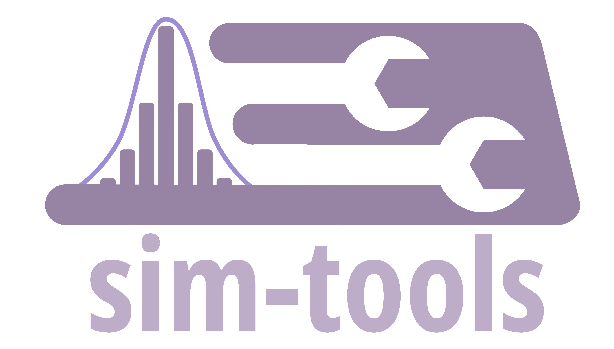

<h1 align="center">
  <a href="https://github.com/sim-tools/sim-tools"></a>
</h1>

<p align="center">
  <i align="center">Tools to support Discrete-Event Simulation (DES) and Monte-Carlo Simulation education and practice</i>
</p>

[](https://mybinder.org/v2/gh/TomMonks/sim-tools/HEAD)
[](https://zenodo.org/badge/latestdoi/225608065)
[](https://pypi.python.org/pypi/sim-tools/)
[](https://anaconda.org/conda-forge/sim-tools)
[](https://anaconda.org/conda-forge/sim-tools)
[](https://sim-tools.github.io/sim-tools)
[](https://opensource.org/licenses/MIT)
[](https://www.python.org/downloads/release/python-360+/)

`sim-tools` is being developed to support Discrete-Event Simulation (DES) and Monte-Carlo Simulation education and applied simulation research.  It is MIT licensed and freely available to practitioners, students and researchers via [PyPi](https://pypi.org/project/sim-tools/) and [conda-forge](https://anaconda.org/conda-forge/sim-tools)

## Vision for sim-tools

 1. Deliver high quality reliable code for DES and Monte-Carlo Simulation education and practice with full documentation.
 2. Provide a simple to use pythonic interface.
 3. To improve the quality of simulation education using FOSS tools and encourage the use of best practice.

## 👥 Authors

<!-- ALL-CONTRIBUTORS-BADGE:START - Do not remove or modify this section -->
[](#contributors-)
<!-- ALL-CONTRIBUTORS-BADGE:END -->

* Thomas Monks &nbsp;&nbsp; [](https://orcid.org/0000-0003-2631-4481)

* Amy Heather &nbsp;&nbsp; [](https://orcid.org/0000-0002-6596-3479)

* Alison Harper &nbsp;&nbsp; [](https://orcid.org/0000-0001-5274-5037)

## Features:

1. Implementation of classic Optimisation via Simulation procedures such as KN, KN++, OBCA and OBCA-m
2. Theoretical and empirical distributions module that includes classes that encapsulate a random number stream, seed, and distribution parameters.
3. An extendable Distribution registry that provides a quick reproduible way to parameterise simulation models.
4. Implementation of Thinning to sample from Non-stationary Poisson Processes (time-dependent) in a DES.
5. Automatic selection of the number of replications to run via the Replications Algorithm.
6. EXPERIMENTAL: model trace functionality to support debugging of simulation models.

## Installation

### Pip and PyPi

```bash
pip install sim-tools
```

### Conda-forge

```bash
conda install -c conda-forge sim-tools
```

### Mamba

`mamba` is a FOSS alternative to `conda` that is also quicker at resolving and installing environments.

```bash
mamba install sim-tools
```

### Binder

[](https://mybinder.org/v2/gh/sim-tools/sim-tools/HEAD)


## Learn how to use `sim-tools`

* Online documentation: https://sim-tools.github.io/sim-tools
* Introduction to DES in python: https://health-data-science-or.github.io/simpy-streamlit-tutorial/

## Citation

If you use sim-tools for research, a practical report, education or any reason please include the following citation.

> Monks, T., Heather, A., Harper, A. (2025). sim-tools: fundamental tools to support the simulation process in python. Zenodo. https://doi.org/10.5281/zenodo.4553641.

```tex
@software{sim_tools,
  author       = {Thomas Monks and Amy Heather and Alison Harper},
  title        = {sim-tools: fundamental tools to support the simulation process in python},
  year         = {2025},
  publisher    = {Zenodo},
  doi          = {10.5281/zenodo.4553641},
  url          = {https://doi.org/10.5281/zenodo.4553641}
}
```

# Online Tutorials

* Optimisation Via Simulation [](https://colab.research.google.com/github/sim-tools/sim-tools/blob/master/docs/02_ovs/03_sw21_tutorial.ipynb)


## Contributing to sim-tools

**All contributions are welcome!** Please see `CONTRIBUTING.md` for instructions on how to contribute.

## Contributors ✨

Thanks goes to these wonderful people ([emoji key](https://allcontributors.org/docs/en/emoji-key)):

<!-- ALL-CONTRIBUTORS-LIST:START - Do not remove or modify this section -->
<!-- prettier-ignore-start -->
<!-- markdownlint-disable -->
<table>
  <tbody>
    <tr>
      <td align="center" valign="top" width="14.28%"><a href="https://experts.exeter.ac.uk/19244-thomas-monks"><br /><sub><b>Tom Monks</b></sub></a><br /><a href="https://github.com/sim-tools/sim-tools/commits?author=TomMonks" title="Code">💻</a> <a href="#data-TomMonks" title="Data">🔣</a> <a href="#design-TomMonks" title="Design">🎨</a> <a href="https://github.com/sim-tools/sim-tools/commits?author=TomMonks" title="Documentation">📖</a> <a href="#ideas-TomMonks" title="Ideas, Planning, & Feedback">🤔</a> <a href="#infra-TomMonks" title="Infrastructure (Hosting, Build-Tools, etc)">🚇</a> <a href="#maintenance-TomMonks" title="Maintenance">🚧</a> <a href="https://github.com/sim-tools/sim-tools/pulls?q=is%3Apr+reviewed-by%3ATomMonks" title="Reviewed Pull Requests">👀</a> <a href="https://github.com/sim-tools/sim-tools/commits?author=TomMonks" title="Tests">⚠️</a> <a href="#tutorial-TomMonks" title="Tutorials">✅</a></td>
      <td align="center" valign="top" width="14.28%"><a href="https://www.linkedin.com/in/amyheather"><br /><sub><b>Amy Heather</b></sub></a><br /><a href="https://github.com/sim-tools/sim-tools/issues?q=author%3Aamyheather" title="Bug reports">🐛</a> <a href="https://github.com/sim-tools/sim-tools/commits?author=amyheather" title="Code">💻</a> <a href="https://github.com/sim-tools/sim-tools/commits?author=amyheather" title="Documentation">📖</a> <a href="#ideas-amyheather" title="Ideas, Planning, & Feedback">🤔</a> <a href="#infra-amyheather" title="Infrastructure (Hosting, Build-Tools, etc)">🚇</a> <a href="#maintenance-amyheather" title="Maintenance">🚧</a> <a href="https://github.com/sim-tools/sim-tools/commits?author=amyheather" title="Tests">⚠️</a></td>
      <td align="center" valign="top" width="14.28%"><a href="https://github.com/AliHarp"><br /><sub><b>Alison Harper </b></sub></a><br /><a href="https://github.com/sim-tools/sim-tools/commits?author=AliHarp" title="Documentation">📖</a></td>
      <td align="center" valign="top" width="14.28%"><a href="https://sammirosser.com/"><br /><sub><b>Sammi Rosser</b></sub></a><br /><a href="https://github.com/sim-tools/sim-tools/issues?q=author%3ABergam0t" title="Bug reports">🐛</a> <a href="https://github.com/sim-tools/sim-tools/commits?author=Bergam0t" title="Code">💻</a></td>
    </tr>
  </tbody>
</table>

<!-- markdownlint-restore -->
<!-- prettier-ignore-end -->

<!-- ALL-CONTRIBUTORS-LIST:END -->

This project follows the [all-contributors](https://github.com/all-contributors/all-contributors) specification. Contributions of any kind welcome!