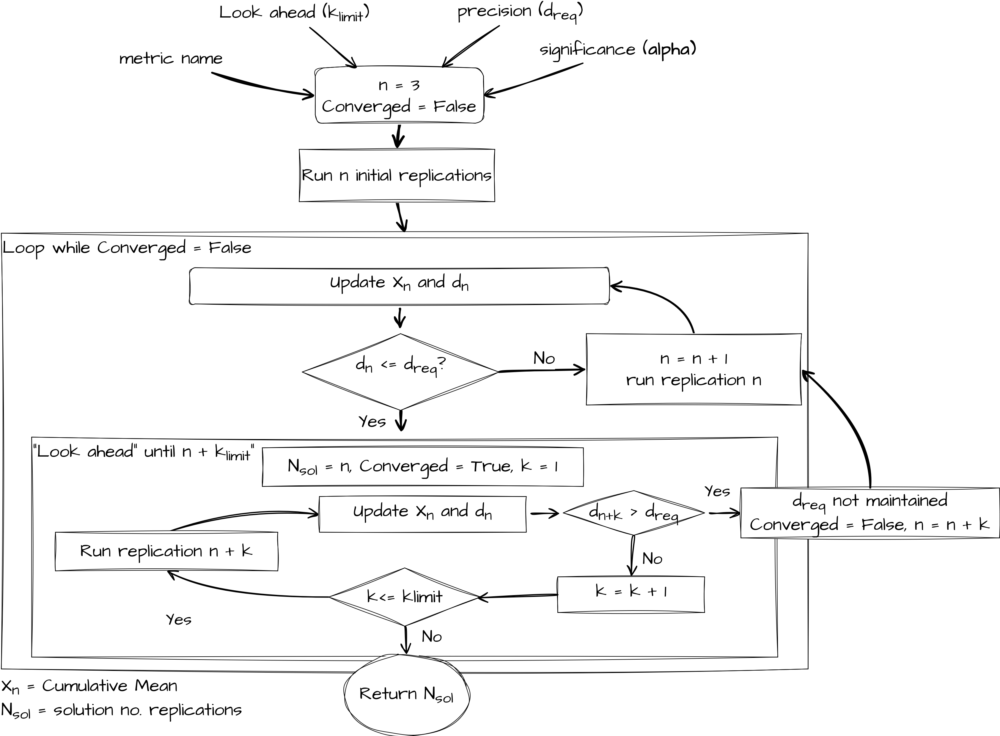

The `sim-tools` package includes an implementation of the "replications algorithm" from [Hoad, Robinson, & Davies (2010)](https://www.jstor.org/stable/40926090), used to automatically determine the number of simulation replications needed to achieve a user-specified confidence interval (CI) precision. It works by combining:

* **The confidence interval method** (described on [the previous page](02-confint_method.qmd)), which estimates the required replications for a target CI half-width.
* **A sequential look-ahead procedure** to check whether the desired CI precision is still met as additional replications are run.

If you make use of this code in your work **please cite the `sim-tools` as well as the original authors article**:

> Hoad, Robinson, & Davies (2010). Automated selection of the number of replications for a discrete-event simulation. *Journal of the Operational Research Society*. [https://www.jstor.org/stable/40926090](https://www.jstor.org/stable/40926090)

**Note:** The examples below use the `treat-sim` model. If you haven't run it before, see [Using the example `treat-sim` model](01-treatsim.qmd) for set-up and basic usage.


## Imports

```{python}
from collections.abc import Callable

from treat_sim.model import Scenario, single_run

from sim_tools.output_analysis import (
    ReplicationsAlgorithm,
    ReplicationsAlgorithmModelAdapter,
    ReplicationTabulizer,
    plotly_confidence_interval_method,
)


```

##  Replications Algorithm overview

The look ahead component is governed by the formula below. A user specifies a look ahead period called $k_{limit}$. If $n \leq 100$ then a parameter $k_{limit}$ is used.  Hoad et al.(2010) recommend a value of 5 based on extensive empirical work. If $n \geq 100$ then a fraction is returned.  The notation $\lfloor$ and $\rfloor$ mean that the function must return an integer value (as it represents the number of replications to look ahead).   

$$
f(k_{limit}, n) = \left\lfloor \dfrac{k_{limit}}{100}\max(n, 100)\right\rfloor 
$$

In general $f(k_{limit}, n)$ means that as the number of replications increases so does the look ahead period.  For example when you have run 50 replications a $k_{limit} = 5$ means you simulate an extra 5 replications.  When you have run 800 replications, a $k_{limit} = 5$ means the number of extra replications you simulate is:

$$
\left\lfloor \dfrac{5}{100} \times 800\right\rfloor = 40
$$

The paper provides a formal algorithm notation. Here we provide a pictorial representation of the general logic of the replications algorithm.



## Observers

The `ReplicationAlgorithm` requires an observer. This is an object whose job it is to watch each replication in your algorithm and record relevant statistics as the simulation runs.

A suitable observer is supplied by default - `ReplicationTabulizer` - but you can also create your own, but it needs to follow this protocol:

```{.python}
@runtime_checkable
class AlgorithmObserver(Protocol):
    """
    Protocol for observer classes used in ReplicationsAlgorithm.

    Classes implementing this protocol should provide a `dev` attribute
    to store observations, a method `update` to add new results, and a
    `summary_table` method to summarize the stored replication statistics.

    Attributes
    ----------
    dev : List[Any]
        Collection of observed replication results.

    Methods
    -------
    update(results) -> None
        Add an observation of a replication.

    summary_table() -> pd.DataFrame
        Create a DataFrame summarising all recorded replication statistics.
    """

    dev: List[Any]

    def update(self, results) -> None:
        ...

    def summary_table(self) -> pd.DataFrame:
        ...
```

<div class="alert alert-block alert-info">

**What does this mean?**

`AlgorithmObserver` essentially just tells us that:

* There should be a `.dev` attribute containing the percentage deviation.
* There should be an `update()` method which updates statistics after each replication.
* There should be a `summary_table()` method which returns a dataframe summarising the replication results.

</div>

## Adapting a simulation model to work with `ReplicationsAlgorithm`

### Why an adapter is needed

Every simulation model has it's own way of:

* Being initialised (parameters, scenario set-up)
* Running a single replication (function/method name, arguments)
* Returning results (scalar, dict, `DataFrame`, etc.)

The `ReplicationsAlgorithm` needs to be able to **call any model in a consistent way**, regardless of those differences. To do that, we need to wrap models in an **Adapter** - a "wrapper" object exposing a **fixed interface** the algorithm can use.

### Required interface

We formalise what the adapter must look like with a **Protocol** called `ReplicationsAlgorithmModelAdapter`.

```{.python}
@runtime_checkable
class ReplicationsAlgorithmModelAdapter(Protocol):
    """
    Adapter pattern for the "Replications Algorithm".

    All models that use ReplicationsAlgorithm must provide a
    single_run(replication_number) interface.
    """

    def single_run(self, replication_number: int) -> dict[str, float]:
        """
        Run a single unique replication of the model and return results.

        Parameters
        ----------
        replication_number : int
            The replication sequence number.
        
        Returns
        -------
        dict[str, float]
            {'metric_name': value, ... } for all metrics being tracked.
        """
        pass
```

<div class="alert alert-block alert-info">

**What does this mean?**

`ReplicationsAlgorithmModelAdapter` essentially just tells us that:

* There should be a `single_run()` method which is passed the `replication_number` to seed it.
* It should return a **dictionary** mapping metric name to float value for *every* requested metric, after just one replication.

</div>

### Adapter for `treat-sim`

Below is an adapter for the `treat-sim` model.

```{python}
class TreatSimAdapter:
    """
    treat-sim multi-metric single_run interface adapter for the
    ReplicationsAlgorithm.
    """

    def __init__(
        self,
        scenario: Scenario,
        metrics: list[str],
        single_run_func: Callable,
        run_length: float | None = 1140.0,
    ):
        """
        Parameters:
        ------------
        scenario: Scenario
            The experiment and parameter class for treat-sim

        metrics: list[str]
            The metric(s) to output

        single_run_func: Callable
            The single run function that is being adapted.
            This must return something indexable by metric name.

        run_length: float, optional (default = 1140)
            The run_length for the model
        """
        self.scenario = scenario
        self.metrics = metrics
        self.single_run_func = single_run_func
        self.run_length = run_length

    def single_run(self, replication_number: int) -> dict[str, float]:
        """
        Conduct single run of the simulation.
        Returns a dictionary of {metric_name: value}.
        """
        results_df = self.single_run_func(
            self.scenario,
            rc_period=self.run_length,
            random_no_set=replication_number,
        )
        return {metric: results_df[metric].iloc[0] for metric in self.metrics}
```

Note that `TreatSimAdapter` **does what is says on the tin**: it adapts the model so that its implements the expected interface. I.e. 

```{python}
METRICS = ["01a_triage_wait", "01b_triage_util", "02a_registration_wait"]

ts_model = TreatSimAdapter(
    scenario=Scenario(), metrics=METRICS, single_run_func=single_run
)

ts_model.single_run(1)
```

The Protocol `ReplicationsAlgorithmModelAdapter` is marked as `@runtime_checkable`, which allows us to check at runtime that any supplied model conforms to the expected interface.

```{python}
print(isinstance(ts_model, ReplicationsAlgorithmModelAdapter))
```

## Example usage

### Running `ReplicationsAlgorithm` on a single metric

```{python}
# Set up model with adapter
ts_model = TreatSimAdapter(
    scenario=Scenario(), metrics=["01a_triage_wait"], single_run_func=single_run
)

# Run algorithm
analyser = ReplicationsAlgorithm(observer_factory=ReplicationTabulizer)
nreps, summary_frame = analyser.select(model=ts_model, metrics=["01a_triage_wait"])

# Preview results
print(nreps)
summary_frame.head()
```

You can visualise the tabulized results using the `plotly_confidence_interval_method` function.

```{python}
plotly_confidence_interval_method(
    n_reps=nreps["01a_triage_wait"],
    conf_ints=summary_frame[summary_frame["metric"] == "01a_triage_wait"],
    metric_name="01a_triage_wait",
)
```

### Running `ReplicationsAlgorithm` on a multiple metrics

```{python}
METRICS = ["01a_triage_wait", "01b_triage_util", "02a_registration_wait"]

# Set up model with adapter
ts_model = TreatSimAdapter(
    scenario=Scenario(), metrics=METRICS, single_run_func=single_run
)

# Run algorithm
analyser = ReplicationsAlgorithm(observer_factory=ReplicationTabulizer)
nreps_m, summary_frame_m = analyser.select(model=ts_model, metrics=METRICS)

# Preview results
print(nreps_m)
summary_frame_m.head()
```

```{python}
for metric in METRICS:
    mask = summary_frame_m["metric"] == metric
    fig = plotly_confidence_interval_method(
        n_reps=nreps_m[metric],
        conf_ints=summary_frame_m[mask].reset_index(),
        metric_name=metric,
    )
    fig.show()
```

